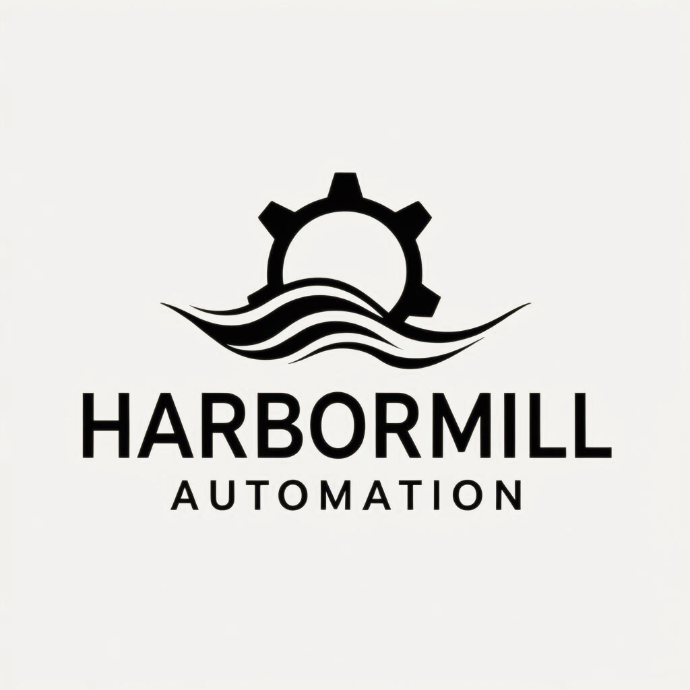

  

### Hi, I'm Damon Williams 👋

**Founder of [Harbormill Automation](https://harbormill.net)** — I build practical AI automation that small businesses can actually trust.

15 years as an enterprise IT senior network engineer — building and securing the networks companies like Nike and Assurant run on — taught me to build systems that are safe to leave running. Now I bring that same discipline to AI automation: least-access by default, reliability first, and your data staying yours.

**What I'm building**
- 🧭 **Harbormill AIOS** — a white-label AI operating dashboard: live metrics + an assistant that answers from your own data. *(React · TypeScript · Supabase · Anthropic Claude)*
- 🧰 **AIS-OS** — an open-source (MIT) starter kit for building a personal AI operating system.
- 🏗️ **HMA Project Foundation** — a multi-agent system that takes products from idea to ship.

**Stack:** TypeScript/React · Python · Supabase/Postgres · Anthropic Claude · RAG · APIs & webhooks · Azure · enterprise networking

📫 dwilliams@harbormill.net · 💼 [LinkedIn](https://www.linkedin.com/in/damon-hma) · 🌐 [harbormill.net](https://harbormill.net)
